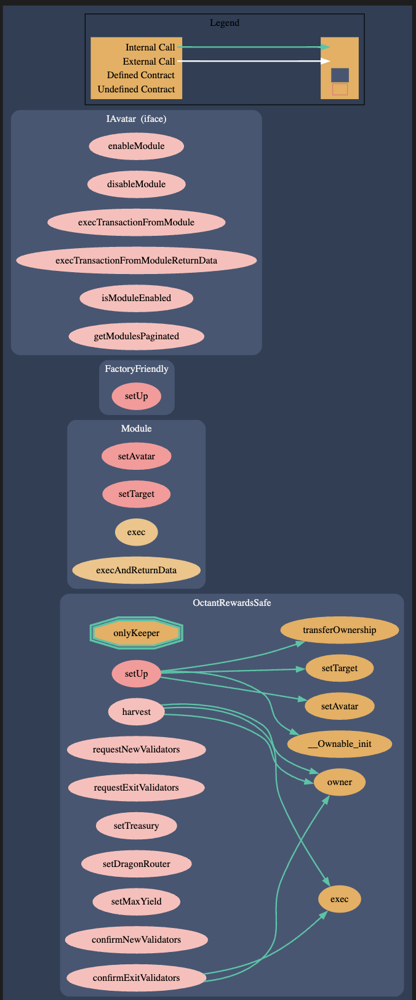

# Octant Rewards Safe Module

## Smart Contract Overview:

Octant Rewards Safe Module is a custom module built for managing golem foundation's staking operations to fund Octant which currently has setup limitations.

- Owner request's adding and removing of validators which is fulfilled by the keeper (node operator).
- Keeper confirms addition of new validators and removal of validators. When removal of validators is confirmed, principal from safe multisig is moved to the treasury address.
- harvest() function can be called by anyone to redirect only the yield portion to the dragon router.

## Inheritance Structure:

Detailed list of inherited contracts and their roles.

- `zodiac/core/Module.sol` - base contract that enables Safe Module functionality by forwarding calls to safe's `execTransactionFromModule`.

## Smart Contract Flow Diagram:

## Attack Surface:

- AS1: harvest() would be bricked if yield is kept accumulating for a long time which results in owner().balance exceeding maxYield. In that case the owner of the module would have to manually send the yield to the dragon router.
- AS2: If the owner's safe multisig is exploited (ie. private keys are leaked) then attacker can increase the max yield and redirect the principal to the dragon router. In this case also the funds would not be lost. We will have rescue funds on the dragon router which may allow us to rescue these funds.

## Mitigation Strategies:

- AS1: To mitigate this we setup a bot that harvests at regular intervals to avoid owner().balance exceeding maxYield.
- AS2: We could add Octant Governance multisig as a second to the dragon's safe which would re-verify transactions and provide another layer of security.
