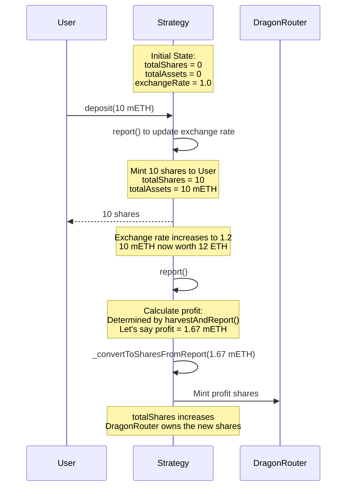

# Contract Summary and Internal Security Audit Report on YieldBearingDragonTokenizedStrategy

## YieldBearingDragonTokenizedStrategy.sol

### High-Level Overview

YieldBearingDragonTokenizedStrategy is a specialized extension of DragonTokenizedStrategy designed specifically for handling yield-bearing tokens like mETH (Mantle's liquid staked ETH). The strategy introduces critical exchange rate tracking to ensure the protocol can capture yield from the appreciation of the token.

This specialized vault allows strategies to capture yield from tokens whose value in ETH terms increases over time (like liquid staked ETH) without requiring active management or external protocol integrations. It directs profit shares to the dragonRouter when the underlying token appreciates in value.

### Key Features

#### Exchange Rate Tracking

The contract relies on an external interface to track the exchange rate between the yield-bearing token and ETH:

```solidity
function _getCurrentExchangeRate() internal view returns (uint256) {
  return IMethYieldStrategy(address(this)).getCurrentExchangeRate();
}
```

#### Profit Calculation and Distribution

The contract implements custom share calculation logic to ensure that profit shares are accurately calculated:

```solidity
function _convertToSharesFromReport(
  StrategyData storage S,
  uint256 assets,
  Math.Rounding _rounding
) internal view virtual returns (uint256) {
  // Saves an extra SLOAD if values are non-zero.
  uint256 totalSupply_ = _totalSupply(S);
  // If supply is 0, PPS = 1.
  if (totalSupply_ == 0) return assets;

  uint256 totalAssets_ = _totalAssets(S);
  // If assets are 0 but supply is not PPS = 0.
  if (totalAssets_ == 0) return 0;

  return assets.mulDiv(totalSupply_, totalAssets_ - assets, _rounding);
}
```

### Visual Representation of Deposit, Harvest, and Shares Flow



### Overridden Functions & Their Changes

#### 1. report

**Key Changes:**

- Calls `harvestAndReport()` to determine profit in mETH terms
- Uses custom share calculation logic for profit shares
- Mints profit shares directly to the dragonRouter
- Updates the lastReport timestamp

```solidity
function report() public override(DragonTokenizedStrategy) returns (uint256 profit, uint256 loss) {
  StrategyData storage S = super._strategyStorage();

  // Get the profit in mETH terms
  profit = IBaseStrategy(address(this)).harvestAndReport();
  address _dragonRouter = S.dragonRouter;

  if (profit > 0) {
    // Mint shares based on the adjusted profit amount
    uint256 shares = _convertToSharesFromReport(S, profit, Math.Rounding.Floor);
    // mint the mETH value
    _mint(S, _dragonRouter, shares);
  }

  // Update the new total assets value
  S.lastReport = uint96(block.timestamp);

  emit Reported(
    profit,
    loss,
    0, // Protocol fees
    0 // Performance Fees
  );

  return (profit, loss);
}
```

#### 2. \_depositWithLockup

**Key Changes:**

- Calls report() before deposit to ensure the exchange rate is updated
- Delegates to the parent implementation for the actual deposit handling

```solidity
function _depositWithLockup(
  uint256 assets,
  address receiver,
  uint256 lockupDuration
) internal override returns (uint256 shares) {
  // report to update the exchange rate
  ITokenizedStrategy(address(this)).report();

  shares = super._depositWithLockup(assets, receiver, lockupDuration);

  return shares;
}
```

### Example Scenario

1. User deposits 10 mETH at exchange rate 1:1 (worth 10 ETH)

   - Strategy calls report() to update exchange rate
   - User receives 10 shares (assuming 1:1 share-to-asset ratio at deposit)

2. Exchange rate increases to 1.2:1

   - Strategy holds 10 mETH (now worth 12 ETH)
   - During report():
     - harvestAndReport() determines profit (e.g., 1.67 mETH)
     - \_convertToSharesFromReport() calculates shares to mint
     - Profit shares are minted to the dragonRouter

3. User deposits additional mETH:

   - Strategy calls report() to update exchange rate
   - New shares are calculated and issued to the user

4. User withdraws:
   - Uses parent implementation for withdrawal
   - Receives their proportional share of the underlying assets

### Security Implications

1. **Exchange Rate Dependency**

   - Strategy relies on accurate exchange rates from the IMethYieldStrategy interface
   - All profit calculations depend on the integrity of the exchange rate

2. **Profit Calculation**

   - The specialized `_convertToSharesFromReport` method ensures accurate profit share calculation
   - Uses `totalAssets_ - assets` to properly account for the new assets in the share price

3. **Report Timing**
   - Exchange rate updates happen during report() calls
   - Deposits trigger a report() to ensure up-to-date exchange rates
