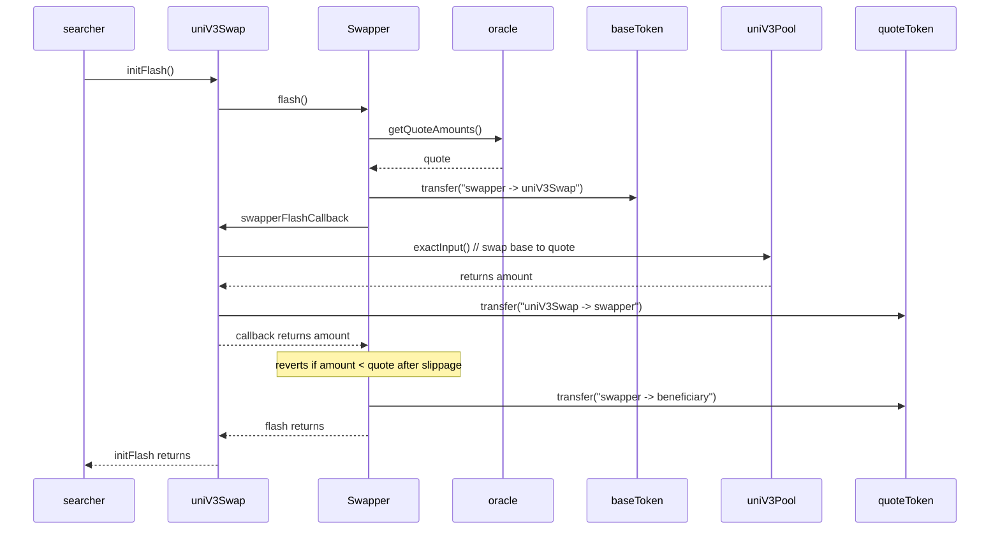

# Trader.sol

## Executive summary
Trader is a contract that allows its deployer to DCA into a token (quote token) in terms of base token at random times. In situation when there exist a separation between principal and agent (as in company and employee situation) Trader allows agent to convert one token into other in a way which precludes accusation of insider trading. Agent (the deployer) is on equal terms with everyone else w.r.t knowledge of when trades will occur. Other useful functionality offered by Trader is long-term automation of the process. This happens at some cost in terms of gas and slippage.

### Core functionality
1. DCA at random times on a pair of tokens.
   Base token is spent at some average rate to buy quote token. Moments when trades can be made are decided by blockhash of block. Potential weakness of blockhash as randomness source is addressed by spending speed limit set from above and Ethereum mainnet censorship resistance guarantees from below.
2. Respects deadlines.
   Trader will spent its *budget* before a *deadline*. Deadlines occur at the end of each *period*. A single *budget* will be spent in a single *period*. Notion of budget is different from amount of base token held by the Trader.
3. Driven by MEV searchers.
   MEV searchers are incentivised to execute trades, sending transactions, paying for gas and getting whatever MEV they can get. Contract attempts to control how much MEV can be extracted by utilizing TWAP oracle for price information.

### Limitations
Deadlines as implemented have two limitations, one on spending side, other on trading side. Randomness functionality (spending side) depend on chain enforcing average block times. Without such enforcement, deadline might be missed. I.e. if we are in a middle of the period and chain has stopped producing blocks, we will not be able to spend the other half of the budget. On trading side, deadline might be missed because of bad market conditions: times of very high volatility on a traded pair. In such case, consider changing spending limits in next period.

Other limitation is linked to a way integration with exchange is done. Trading is done against a single uniswap v3 pool. This limits the amount of available liquidity. More work is needed to figure out if TWAP protection can be extended to trades via a router.

### Responsibilities
`Trader.sol` implements triggering at random times, periods, budgets, deadlines and overspending protection. It doesn't directly integrate with an exchange. This responsibility outsourced to a pair of contracts. `UniV3Swap.sol` does trading via Uniswap V3 and `SwapperImpl.sol` does consult the TWAP oracle and makes sure principal (`beneficiary` in Trader's parlance) is not being short-changed during the trade. Both contracts are a part of [0xSplits project](https://github.com/0xSplits/splits-swapper/). They are denoted as `integrator` and `swapper` inside `Trader.sol`.

Trader exposes two sets of interfaces. One is `transform(...)`, as defined in `ITransformer.sol`. It is supposed to be called downstream of a call to router's `claimSplit(...)`. Example of its usage is in `TraderBotEntry.sol` contract. Other is `convert(...)`, and it accepts block height. If successful, it will send some amount of base token to `swapper` address. Convert is internally used by `transform(...)`.

### Randomness design
Design has following goals:
* MEV: trader shouldn't be more exposed to MEV compared to normal EOA. This means that network shouldn't have early warnings about Trader wanting to trade at particular block.
* Fairness: no parties should have privileged information. Existence of such parties exposes funds to market manipulation risk and creates legal risks for the team. This precludes usage of private randomness sources.
* Gas effectiveness: this mechanism should be cheap. If we can avoid burning gas on failed txes, we should do it.

This means that we need to roll a dice as late as possible, and not pay any gas for failed rolls. This excludes external oracles (such as Chainlink). Among viable sources there are `blockhash` and `block.prevrandao`. Both allow searchers to learn if tx can be included at height N at the moment when block N-1 is propagated. Latter is less biasable, but creates a problem. Smart-contract has access only to current `block.prevrandao`. If tx is not included at particular height (one with "good randomness"), it will see bad randomness and will burn gas on a failed tx. This problem can be addressed by reliance on Flashbots feature that allows to include tx only at a particular height or not include it at all. `Blockhash` is biasable by block builders. By biasing, attacker can "speed up" trades with good randomness or slow them down with bad randomness. We've put overspending protection to guard against first. Second one is equivalent to censorship, a type of attack Ethereum was built to prevent.
On a separate note. To exploit blockhash grinding ability, attacker needs to build block N-1 and exploit their special knowledge in block N. This MEV opportunity is in multi-block MEV class - thing that wasn't observed yet on mainnet. Multi-block MEV exploitation breaks many things in Ethereum ecosystem. Among them are TWAPs and censorship resistance of network as whole.

To summarize: we use `blockhash` as a source of randomness. We are aware of its drawbacks. If we will see attacks against it, we can switch to `block.prevrandao` and redeploy.

### Frontrunning
With `blockhash[]` approach all network participants learn about possibility of trade at height $N$ simultaneously. All of them can attempt to frontrun transaction, but MEV that can be extracted is limited by our usage of TWAP. When asked for a quote, TWAP takes into account only trades that are from heights $N-1$ and older. This means that an attempt to sandwich our trade must alternatively:  
* happen in multiple blocks instead of one OR  
* be in the same block, but be small enough to fit into slippage defined as difference between quote we get from oracle and AMM price we get.

First approach is not available for parties not capable of multi-block MEV extraction. In second case the deployer chooses how much slippage they are willing to accept. Tighter slippage means higher risk of missing a deadline. Author recommends to start from liberal 2% and tighten it up as the time goes until distribution of trades in time becomes left-skewed.

### How splitter-swapper uses Oracle

